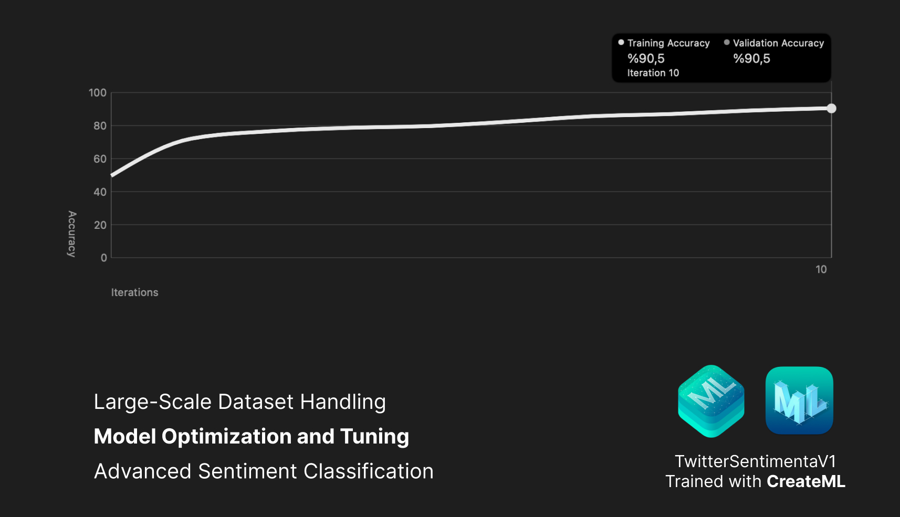

# Twitter Sentiment Analysis AI Model 🐦📊

### Advanced Sentiment Analysis with Twitter Data

The **Twitter Sentiment Analyzer** is a machine learning model designed to classify the sentiment of tweets and messages as positive, negative, or neutral. Initially introduced as a course challenge, I elevated this project by expanding the dataset to 300,000 tweets and enhancing accuracy to over 80%. This model was trained using Create ML and is ready for integration into iOS applications for real-time sentiment analysis.

## Project Overview
This project leverages Create ML to train a Core ML sentiment analysis model, moving beyond basic tweet classification. Due to Twitter API’s paid restrictions, this model was adapted to analyze general user-submitted text for sentiment, allowing flexibility without requiring Twitter API access.

## Learning Outcomes
- **Large-Scale Dataset Handling**: Acquired experience training models on large datasets (300,000 tweets) to improve model accuracy.
- **Model Optimization and Tuning**: Fine-tuned hyperparameters to increase model precision and accuracy significantly.
- **Advanced Sentiment Classification**: Enhanced understanding of sentiment analysis, applicable to various text sources beyond tweets.

## Key Skills
- Dataset preparation and processing for high-volume data
- Sentiment classification and text analysis with Core ML
- Model deployment within iOS apps for real-time user interaction

## Additional Features
- **Offline Sentiment Analysis**: The model operates independently of Twitter API, allowing users to analyze the sentiment of any text input.
- **High Accuracy**: Achieved over 80% accuracy, making it suitable for practical applications in customer sentiment analysis, feedback processing, etc.

---

### Footer

---

## Contact
For more information, feel free to reach out:  
- **Email**: [aranfononi@gmail.com](mailto:aranfononi@gmail.com)  
- **LinkedIn**: [Aran Fononi](https://www.linkedin.com/in/aran-fononi-18182b265)
